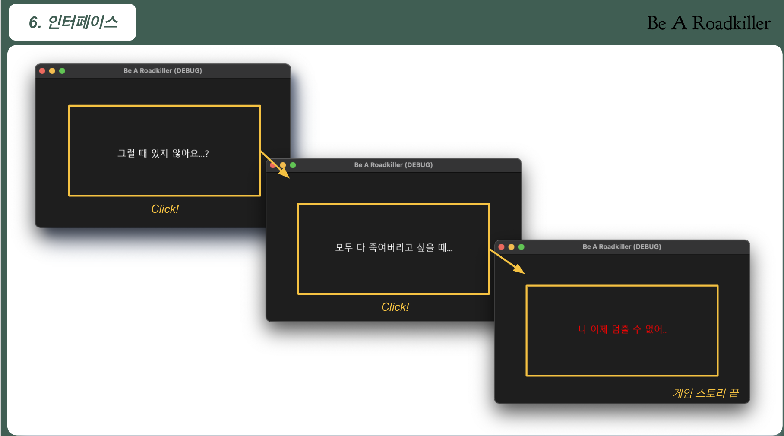

# Be a roadkiller

## 게임 개발 배경

착하게 사는 것은 계단을 올라가는 것과 같다. **착한 사람으로서의 이미지**를 강요하는 현대 사회에서 **착한 아이 증후군**을 앓고 있는 사람들이 많다. **착한 아이 콤플렉스**라고도 불리는 이 증후군은 어른이 되어서도 자신의 감정을 솔직히 표현하지 못하고, 타인에게 착한 사람으로 남기 위해 욕구나 소망을 억압하며 지나치게 노력하는 것을 말한다. 이러한 노력이 지나치게 되면, 그 내면은 자신의 욕구를 억제하고 희생하는데 따르는 우울증을 야기하기도 한다.
취업 고민, 상사와의 갈등 등 각박한 현대 사회에서 **착한 아이**로 지내며 스트레스를 쌓아온 아이들은 스트레스가 과도하게 쌓여 마음의 **화**를 다스리지 못해 범죄로 이어지기도 한다. 분노사회가 되기 전에 일상에서 스트레스를 해소할 수 있다면, 스스로 마음을 치유할 수 있는 방법이 없을까?
이에 우리는 분노사회에서 해방될 수 있는 게임을 만들고자 했고, `Be A RoadKiller`를 설계하였다. `Be A RoadKiller`의 행복사회로 빠져보자.

## 게임 다운로드 및 실행

#### Godot 다운로드
자신의 운영체제에 맞춰 다운로드 한다.

- window: [Window버전 다운로드](https://godotengine.org/download/windows)
- linux: [Linux버전 다운로드](https://godotengine.org/download/linux)
- mac: [Mac버전 다운로드](https://godotengine.org/download/osx)

#### 게임 다운로드 
~~~
$ git clone https://github.com/C4Ution/be-a-roadkiller.git
~~~

#### 게임 실행

**project.godot을 클릭 후 오른쪽 상단 위  Play 버튼을 눌러주세요!**

{: width="100" height="100"}


```
게임 실행 하는 방법은 이제 끝났다. 우리 함께 참지말고 내재 되어있는 분노를 표출해보자..
```

## 게임 방법

#### 1. Story line
**클릭으로 스토리라인을 넘겨보자..**
{: width="100" height="100"}

{: width="100" height="100"}

#### 2. In Game
**무시무시한 자동차로 사람을 죽여보자.. 무시무시한 음악이 나올 것이다...**
{: width="100" height="100"}

{: width="100" height="100"}


#### 3. End
**모든 사람을 죽였지만 스트레스가 풀리지 않았을 수 있다.. 더죽여보자...**
{: width="100" height="100"}

## 마치며

*게임이 재밌으셨나요..? 한줄평을 남겨주세요..*

`채문`: 이 게임을 하고... 스트레스가 해소되었습니다... 새로운자아를 찾은 것 같네요...  
`혜성`: 사망년의 마지막 반항..  
`홍섭`: 뭉치면 다죽는다.  
`세교`: 착하게 사는 것은 높은 계단을 오르는 것과 같지만 내려오는 것은 포기하고 내려갈 때는 너무나도 빠르고 즐겁다.
